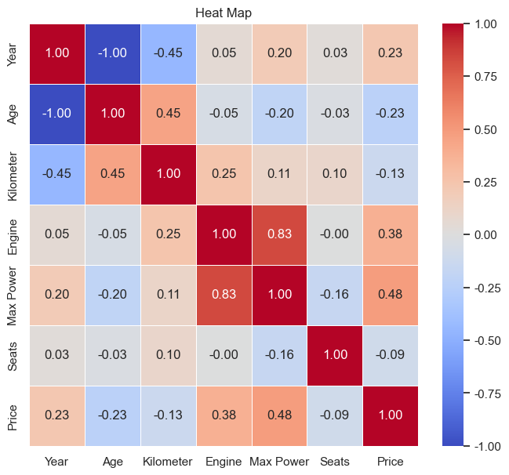

# 基于Full_dataset.csv的进一步分析
## Part 1 数据处理/清洗
主要工作：object型数据转换为数值型数据  
| Column        | Non-Null Count | Dtype   |
|---------------|-----------------|---------|
| Brand         | 12646 non-null  | object  |
| Model         | 12646 non-null  | object  |
| Year          | 12646 non-null  | int64   |
| Age           | 12646 non-null  | int64   |
| Kilometer     | 12646 non-null  | int64   |
| Fuel Type     | 12646 non-null  | object  |
| Engine        | 12478 non-null  | float64 |
| Max Power     | 12646 non-null  | object  |
| Transmission  | 12646 non-null  | object  |
| Seats         | 12646 non-null  | int64   |
| Price         | 12646 non-null  | int64   |

dtypes: float64(1), int64(5), object(5)  

将Fuel Type编码: 'Diesel': 1,'Petrol': 0,'Other': 2  
将Transmission编码: 'Manual': 1, 'Automatic': 0  
将Max Power的错误类型转换成数值型  

最终结果：  
| Column             | Non-Null Count | Dtype   |
|--------------------|-----------------|---------|
| Brand              | 12474 non-null  | object  |
| Model              | 12474 non-null  | object  |
| Year               | 12474 non-null  | int64   |
| Age                | 12474 non-null  | int64   |
| Kilometer          | 12474 non-null  | int64   |
| ~~Fuel Type~~      | 12474 non-null  | object  |
| Engine             | 12474 non-null  | float64 |
| Max Power          | 12474 non-null  | float64 |
| ~~Transmission~~   | 12474 non-null  | object  |
| Seats              | 12474 non-null  | int64   |
| Price              | 12474 non-null  | int64   |
| Transmission_code  | 12474 non-null  | int64   |
| Fuel Type_code     | 12474 non-null  | int64   |

**TODO : 异常值/缺失值处理**

## Part 2 可视化/质量分析
### 小提琴图、核密度图、箱线图
对数据质量进行分析/是否符合一定的分布特征  
### 热力图
可以考虑变量间关系，这个图基本就不会再变了。  
  
### 不同class下的箱线图
可以大概分析不同class是否分布稳定，例：不同燃料类型下，engine箱线图。  
